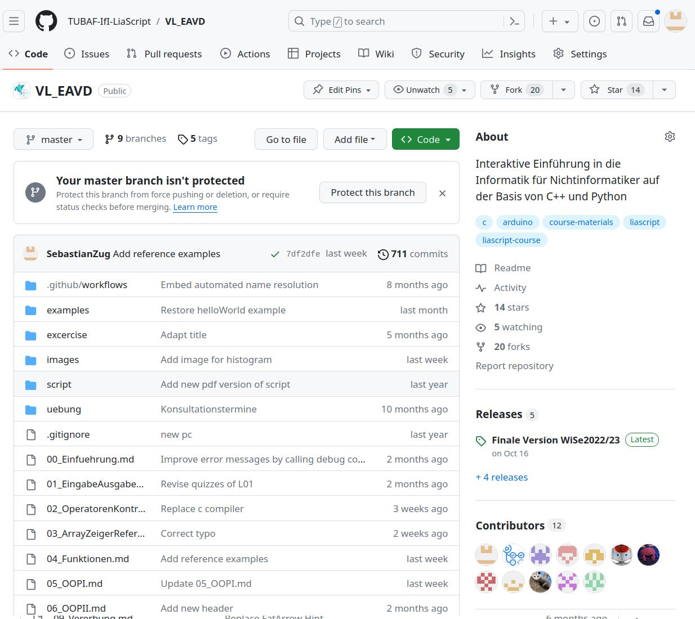
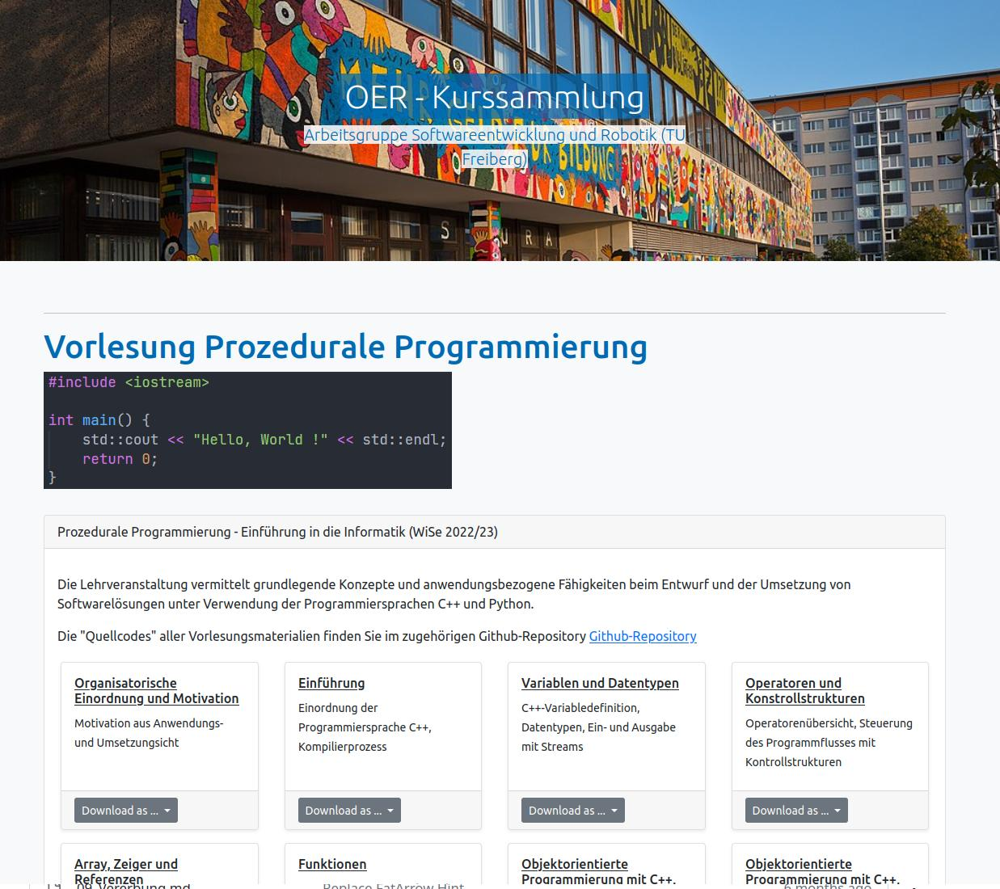
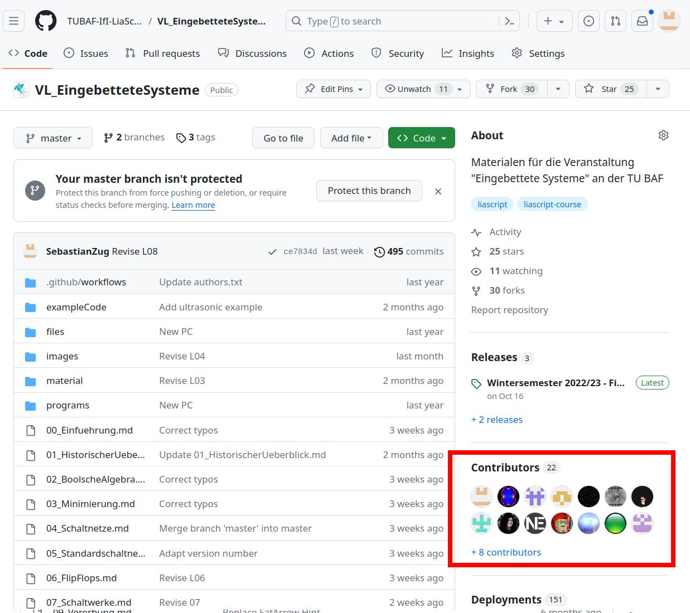
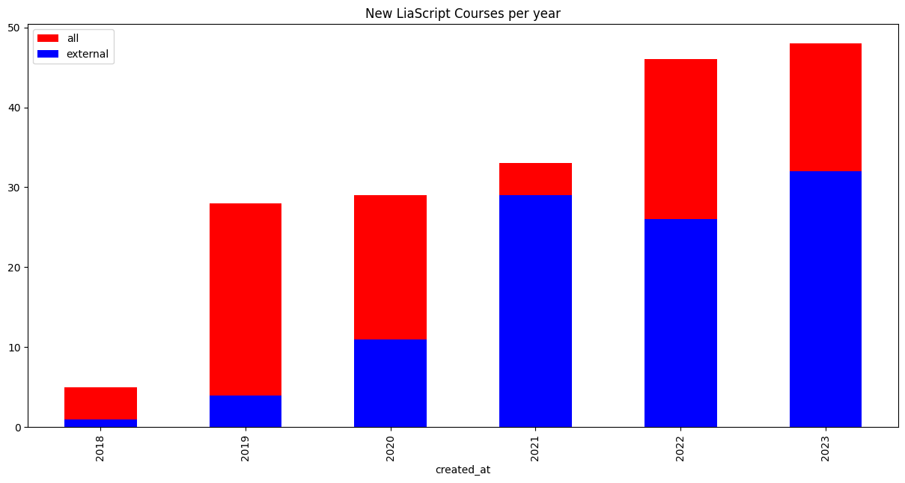

<!--

author:   Sebastian Zug & André Dietrich & Galina Rudolf
email:    sebastian.zug@informatik.tu-freiberg.de & andre.dietrich@ovgu.de & Galina.Rudolf@informatik.tu-freiberg.de
version:  1.0.4
language: de
narrator: Deutsch Female

comment: Summary LiaScript
logo: ./img/LogoCodeExample.png

import: https://github.com/liascript/CodeRunner
        https://github.com/LiaTemplates/AVR8js/main/README.md#10
        https://raw.githubusercontent.com/TUBAF-IfI-LiaScript/VL_EAVD/master/config.md

-->

[](https://liascript.github.io/course/?https://github.com/TUBAF-IfI-LiaScript/VL_ProzeduraleProgrammierung/blob/master/00_Einfuehrung.md)

# 5 years of LiaScript - Lessons learned 

Motivation
============

{{0-1}}
> __Why do we not develop learning contents as Wikipedia or community driven software projects?__

{{0-1}}


                       {{1-3}}
**************************************************

> How does Wikipedia succeeds?

+ Simple context description language
+ Integrated editor
+ Versioning method
+ ...

**************************************************

                       {{2-3}}
**************************************************

> But of course, we cannot map the Wikipedia concept 1:1 to learning content!

Course content ...

+ ... is not only text, but also includes animations, videos, and interactive elements.
+ ... depends on specific learning goals and the didactic concept of the teacher.
+ ... has to be iterated in a learning management system mostly.

**************************************************

## My current usage

Starting in 2018 we switched the learning content of our [courses](https://github.com/TUBAF-IfI-LiaScript) completely to LiaScript.

!?[](https://github.com/LiaPlayground/LiaScript-User-Symposium-2023/raw/main/vid/TUBAF.mp4)

> __I am going to summarize my experiences and usage patterns in this talk.__

### Editing 

+ online editor in Github (press `.` to open)
+ offline editor in Visual Studio Code 



https://github.com/TUBAF-IfI-LiaScript/VL_EAVD

### Dissemination

+ github
+ separate website via Lia exporter



https://github.com/TUBAF-IfI-LiaScript/TUBAF-IfI-LiaScript.github.io

https://tubaf-ifi-liascript.github.io/prozprog.html

### Student feedbacks 

> Students love to correct the professor.



https://github.com/TUBAF-IfI-LiaScript/VL_EingebetteteSysteme/pulls?q=is%3Apr+is%3Aclosed

## Community activities

> LiaScript implements a serverless concept. Hence, we do not have a complete overview about usage and projects. 

+ Which other projects are probably relevant for our work? 
+ Can I find successful collaboration projects based on LiaScript? 
+ Are their new template implementations probably interesting for my work?
+ ...

Let's focus on public Github Repositories ...

### Aggregation method 

```ascii
                            .--------------------.                                               .------------------.     - initial commit
                            | Scanning for repos |                                               | Aggregation of   |     - contributors
                       .--->|                    |---.                                      .--->| repo parameter   |     - stars
 +---------------+     |    '--------------------'   |   Lists of repositories              |    '------------------'     - forks
 | Lia-Keywords  |\    |                             |    .------------------.    unique    |                             - ...
 | URLs          +-+---+                             +--->| Merge & validate |--------------+
 | etc.            |   |                             |    | repository lists | repositories |
 +-----------------+   |    .--------------------.   |    '------------------'              |    .------------------.   +------------+
                       '--->| Scanning for code  |---'                                      '--->| Scanning for     |<--| Lia-File   |\
                            | files              |                                               | LiaScript files  |   | search     +-+  
                            '--------------------'                                               '------------------'   | patterns     |
                                                                                                          |             +--------------+
                                                                                         unique Lia files |
                                                                                                          v
                                                                                                 .------------------.   
                                                                                                 | Aggregation of   |     - content
                                                                                                 | file parameter   |     - language
                                                                                                 '------------------'     - keywords
```

I used the [pygithub](https://github.com/PyGithub/PyGithub) library to access the Github API.

### Data set 

1. We found 523 repositories and 924 courses with different combinations of the keyword `LiaScript`.
2. In 229 repositories we found 598 valid LiaScript files.

The data set is available in the repository of this talk.

### Data analysis

{{0-1}}
1. How many users can be found in data set?

{{0-1}}
```
10 internal and 71 external users.
```

{{1-2}}
2. Which authors produced the most Lia documents?

{{1-2}}
```
arcus                    91
aheil                    27
pyTUNISIA                24
aneesha                  10
AndreaInfUFSM             8
ShortyTwo42               8
RDM4CAU                   8
fjangfaragesh             8
cgliascript               7
kehoffbin                 6
vibbits                   6
gionatamassibenincasa     6
Buhlean                   5
le-rosseburg              5
JMueller-edu              5
```

{{2-3}}
3. Which languages are used in LiaScript documents?

{{2-3}}
```
en    199
de     66
fr     19
it      4
es      3
nl      2
pt      2
```

{{3-4}}
4. Which materials were created by teams of authors?


{{3-4}}
```
https://github.com/aheil/devops                             48
https://github.com/NFDI4Energy/EFZN_rdm                      9
https://github.com/arcus/education_modules                   8
https://github.com/arcus/Arcus_Labs_Orientation              7
https://github.com/RDM4CAU/ufg-summerschool                  7
https://github.com/le-rosseburg/Docsify_Test                 4
https://github.com/aheil/os                                  4
https://github.com/marco-hamann/Geometrie                    4
```

{{4-5}}
5. How many LiaScript documents appear year by year?

{{4-5}}
