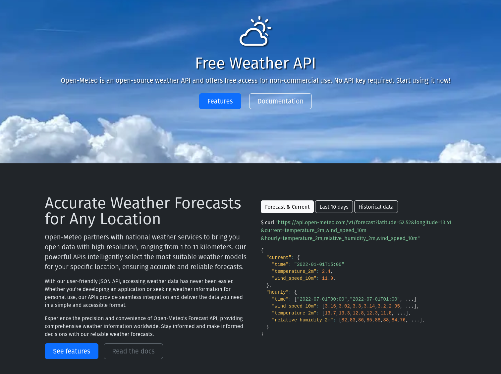

<!--

@style

.image {
  box-shadow: 5px 5px 15px 5px #aaa;
  animation: fadeIn 5s;
}

@keyframes fadeIn {
  0% { opacity: 0; }
  100% { opacity: 1; }
}

.lia-slide__container {
    background-image: url("http://localhost:8000/pic/background.png");
    background-size: cover;
    background-repeat: no-repeat;
    background-position: center;
}


@keyframes wave {
 0% {
   transform: rotate(0deg);
 }
 10% {
   transform: rotate(16deg);
 }
 20% {
   transform: rotate(-6deg);
 }
 30% {
   transform: rotate(16deg);
 }
 40% {
   transform: rotate(-4deg);
 }
 50% {
   transform: rotate(16deg);
 }
 60% {
   transform: rotate(0deg);
 }
 100% {
   transform: rotate(0deg);
 }
}

.waving-hand {
 animation: wave 2.1s 0.6s infinite;
 transform-origin: 75% 75%;
 display: inline-block;
}

.fall {
 position: absolute;
 top: 0;
 animation: fall 2s linear infinite;
}

@keyframes fall {
 0% { top: 0; }
 100% { top: 100%; }
}

@end

-->

# State of LiaScript

> ## _Maybe we were wrong to see Open Educational Resources (OER) as a one-way road, where you only have to produce content that others consume._

{{1}} Supporting Authors (-collaboration)

{{2}} Sharing Courses (the new ways)

{{3}} Scripts hidden (interactive) Gems

{{4}} Classrooms extensions (Lab-Sharing)

## Supporting Authors


<!-- class="image" -->


https://LiaScript.github.io/LiveEditor

### Improvements to the Editor

1. Add buttons next to snippets
2. Improved table-formatting
3. Integration of MathJS

   - simplification
   - evaluation
   - conversion to TeX

4. Stable synchronization with co-Authors

5. Improved Multimedia-Upload & Download:
   
   - Images
   - Audio
   - Upload

6. Sharing Learning-Chunks via Data-URIs / QR-codes

### Improving Collaboration

!?[LiaScript-Editor](https://www.youtube.com/watch?v=EZuxYsMBKO4)

## Sharing Courses

> ## _GitHub can be challenging for non-technical users._
> 
> ## _So what other ways can be used to distribute content?_

### via ...

    {{1}}
<section>

### data-URIs

https://liascript.github.io/course/?data:text/plain;base64,IyBTdGF0ZSBvZiBMaWFTY3JpcHQKCj4gIyMjIF9NYXliZSB3ZSB3ZXJlIHdyb25nIHRvIHNlZSBPcGVuIEVkdWNhdGlvbmFsIFJlc291cmNlcyAoT0VSKSBhcyBhIG9uZS13YXkgcm9hZCwgd2hlcmUgeW91IG9ubHkgaGF2ZSB0byBwcm9kdWNlIGNvbnRlbnQgdGhhdCBvdGhlcnMgY29uc3VtZS5fCgp7ezF9fSBTdXBwb3J0aW5nIEF1dGhvcnMgKC1jb2xsYWJvcmF0aW9uKQoKe3syfX0gU2hhcmluZyBDb3Vyc2VzICh0aGUgbmV3IHdheXMpCgp7ezN9fSBTY3JpcHRzIGhpZGRlbiAoaW50ZXJhY3RpdmUpIEdlbXMKCnt7NH19IENsYXNzcm9vbXMgZXh0ZW5zaW9ucyAoTGFiLVNoYXJpbmcpCgo=

</section>

    {{2}}
<section>

### QR-Codes

[qr-code](https://liascript.github.io/course/?data:text/plain;base64,IyBTdGF0ZSBvZiBMaWFTY3JpcHQKCj4gIyMjIF9NYXliZSB3ZSB3ZXJlIHdyb25nIHRvIHNlZSBPcGVuIEVkdWNhdGlvbmFsIFJlc291cmNlcyAoT0VSKSBhcyBhIG9uZS13YXkgcm9hZCwgd2hlcmUgeW91IG9ubHkgaGF2ZSB0byBwcm9kdWNlIGNvbnRlbnQgdGhhdCBvdGhlcnMgY29uc3VtZS5fCgp7ezF9fSBTdXBwb3J0aW5nIEF1dGhvcnMgKC1jb2xsYWJvcmF0aW9uKQoKe3syfX0gU2hhcmluZyBDb3Vyc2VzICh0aGUgbmV3IHdheXMpCgp7ezN9fSBTY3JpcHRzIGhpZGRlbiAoaW50ZXJhY3RpdmUpIEdlbXMKCnt7NH19IENsYXNzcm9vbXMgZXh0ZW5zaW9ucyAoTGFiLVNoYXJpbmcpCgo=)

</section>

    {{3}}
<section>

### Tor-Network


</section>


    {{4}}
<section>

### IPFS


</section>


    {{4}}
<section>

### WebTorrent


</section>


## Scripting

> ## _The problem of static content is, that shortly after the time of writing, it might already be outdated..._

    {{1}}
<section style="display: flex">

<!-- style="flex: 57.15%;" -->
<div style="width:100%;height:0;padding-bottom:75%;position:relative;"><iframe src="https://giphy.com/embed/4ZgLPakqTajjVFOVqw" width="100%" height="100%" style="position:absolute" frameBorder="0" class="giphy-embed" allowFullScreen></iframe></div><p><a href="https://giphy.com/gifs/hot-cold-liquid-4ZgLPakqTajjVFOVqw">via GIPHY</a></p>

<!-- style="flex: 42.85%;" -->
<div style="width:100%;height:0;padding-bottom:100%;position:relative;"><iframe src="https://giphy.com/embed/xULW8sfwGp5WJIXk9W" width="100%" height="100%" style="position:absolute" frameBorder="0" class="giphy-embed" allowFullScreen></iframe></div><p><a href="https://giphy.com/gifs/nasa-hot-earth-xULW8sfwGp5WJIXk9W">via GIPHY</a></p>

</section>

### How does it work?

```` ascii

 +-------------------+    "{3}{`22*22`}"   +------------------+
 |  "{2}{(ports)}"   +-------------------->|   "JavaScript "  |
 |                   |                     |                  |
 | " LiaScript/Elm " |<--------------------+   "{4}{(eval)}"  |
 +-------------------+    "{5}{`484`}"     +------------------+
          ^
          |" {1}{(parse)} " 
          |
 +-------------------+
 |     README.md     |
 |                   |
 | ...               |
 |  <script>     +---+
 |    22*22      |  /
 |  </script>    | /
 | ...           |/
 +---------------+
````

### Starting Simple

<script>"Hello World"</script>

<script>22*22</script>

### Configuring the Execution

    {{1}}
<script run-once="true">
    var string = "Hello World"
    alert(string)
    string
</script>

    {{2}}
<script run-once="true">
    var calculation = 22*22
    alert(calculation)
    calculation
</script>

### Configuring the Output

    {{0-1}}
<section>

<!-- class="image" -->

https://open-meteo.com/en/docs

</section>

    {{1}}
<script run-once="true" style="display: block">

fetch("https://api.open-meteo.com/v1/forecast?latitude=50.92558&longitude=13.33125&hourly=temperature_2m")
    .then(response => response.json())
    .then(data => {
        let table = "<!-- data-type='lineplot' -->\n"
        table += "| Time | Temperature |\n"
        table += "| ---- | ----------- |\n"

        for(let i=0; i < data.hourly.time.length; i++) {
            table += "| " + data.hourly.time[i] + " | " + data.hourly.temperature_2m[i] + " |\n"
        }

        send.lia("LIASCRIPT: "+table)
    })
    .catch(e => {
        send.lia("ups, something went wrong")
    })

"waiting for the weather"
</script>

### Combining Scripts

The sinus of
<script output="x" default="1" input="number">@input</script>
is
<script>Math.sin(@input(`x`))</script>.

#### Example: Weather

__longitude: <script default="13.33125" input="range" output="longitude">@input</script>__

__latitude: <script default="50.92558" input="range" output="latitude">@input</script>__

<script run-once="true" style="display: block">

fetch("https://api.open-meteo.com/v1/forecast?latitude=@input(`latitude`)&longitude=@input(`longitude`)&hourly=temperature_2m")
    .then(response => response.json())
    .then(data => {
        let table = "<!-- data-type='lineplot' data-show data-title='Weather forecast for @input(`latitude`) - @input(`longitude`)' -->\n"
        table += "| Time | Temperature |\n"
        table += "| ---- | ----------- |\n"

        for(let i=0; i < data.hourly.time.length; i++) {
            table += "| " + data.hourly.time[i] + " | " + data.hourly.temperature_2m[i] + " |\n"
        }

        send.lia("LIASCRIPT: "+table)
    })
    .catch(e => {
        send.lia("ups, something went wrong")
    })

"waiting for the weather"
</script>


#### Example: Macro
<!--
@weather_at: @weather_at_(@uid,@0,@1)

@weather_at_

longitude: <script default="@1" input="range" output="longitude_@0">@input</script>

latitude: <script default="@2" input="range" output="latitude_@0">@input</script>


<script run-once="true" style="display: block">

fetch("https://api.open-meteo.com/v1/forecast?latitude=@input(`latitude_@0`)&longitude=@input(`longitude_@0`)&hourly=temperature_2m")
    .then(response => response.json())
    .then(data => {
        let table = "<!-- data-type='lineplot' data-show data-title='Weather forecast for @input(`latitude_@0`) - @input(`longitude_@0`)' --"+">\n"
        table += "| Time | Temperature |\n"
        table += "| ---- | ----------- |\n"

        for(let i=0; i < data.hourly.time.length; i++) {
            table += "| " + data.hourly.time[i] + " | " + data.hourly.temperature_2m[i] + " |\n"
        }

        send.lia("LIASCRIPT: "+table)
    })
    .catch(e => {
        send.lia("ups, something went wrong", e.message)
    })

"waiting for the weather"
</script>

@end
-->


@weather_at(13.33125,50.92558)


@weather_at(30.5434,50.4383)


## Collaboration

> ## _Peer to Peer could be a baked in concept for OER ... _

### Open a Classroom

!?[How to open a classroom](https://www.youtube.com/watch?v=Kjk6OblugXI)

### New PubSub API

``` javascript
LIA.classroom.connected

LIA.classroom.on("connected", () => {
    console.log("connected")
})

LIA.classroom.on("disconnected", () => {
    console.log("disconnected")
})

LIA.classroom.publish("topic", { data: "Hello World" })

const subID = LIA.classroom.subscribe("topic", (message) => {
    console.log("received", message)
})

LIA.classroom.unsubscribe(subID)
```

#### Simple Voting

<script>
LIA.classroom.on("connected", () => {
    console.log("connected")
})

const hand = document.createElement("span")
hand.innerHTML = "👋"
hand.classList.add("waving-hand")
hand.classList.add("fall")

document.body.appendChild(hand)

</script>


### Edrys-Lite (Peer 2 Peer Labs)

<!-- class="image" -->

https://github.com/Cross-Lab-Project/edrys-Lite/

https://cross-lab-project.github.io/edrys-Lite/

### Customization